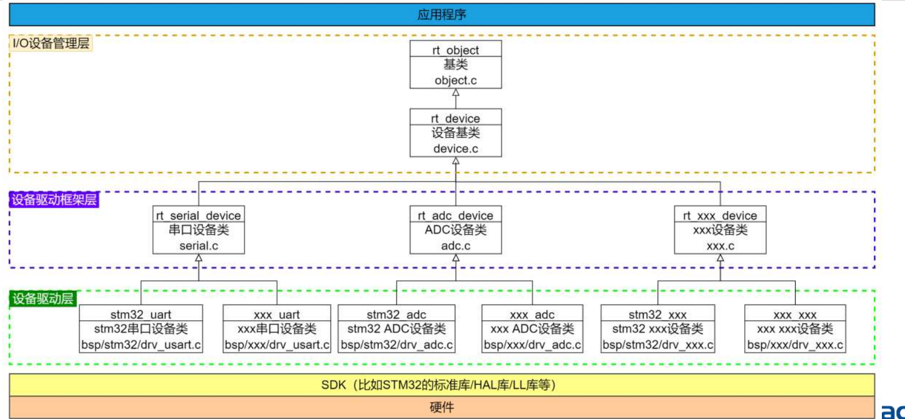
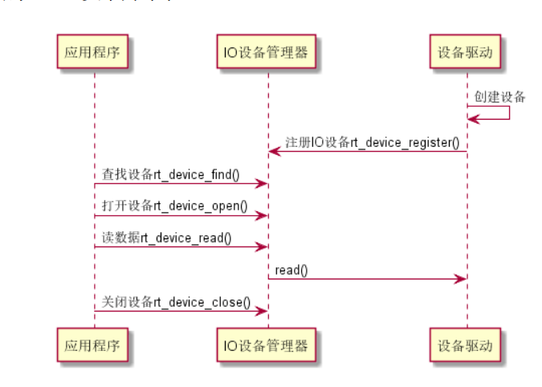
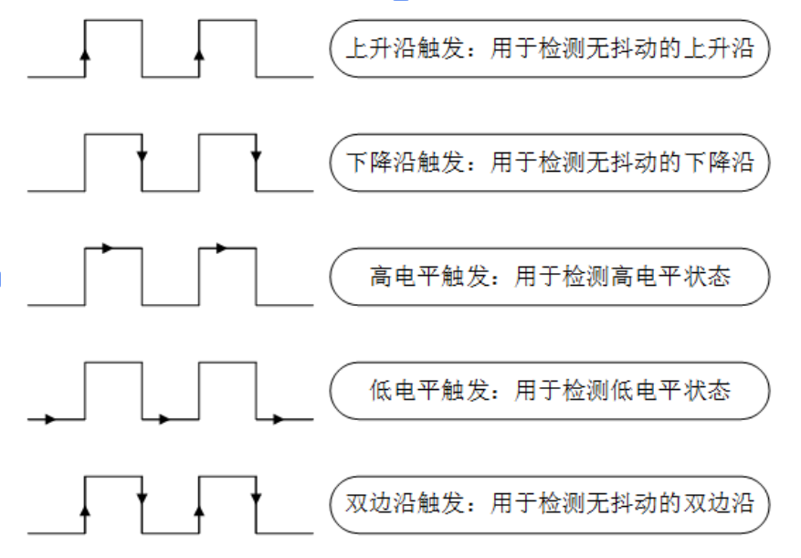
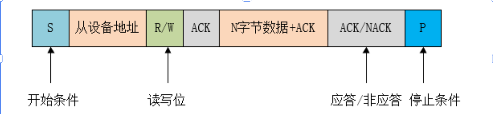
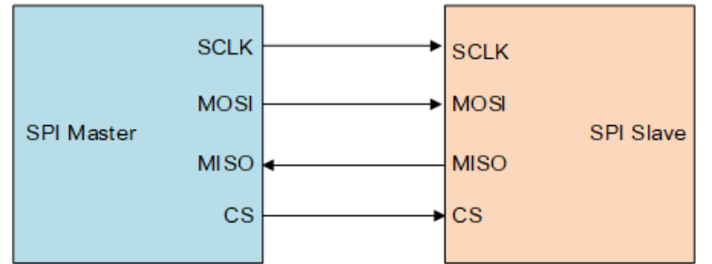

# RT-Thread设备驱动

## I/O设备驱动

### SPI驱动和设备驱动分离了，提供统一的API：

• 更换 MCU 只需要改变对应的对接驱动

 • 重新驱动设备，只需要重新编写设备驱动相关的代码 

• 同一 API 接口，学习成本低

 • 分离后设备驱动可以入库，供公司其他项目使用，减少碎片化开发，防止反复造轮子

 • 代码框架会变复杂，但是从上面的优点来看是值得的

### RT-Thread设备驱动框架




### RT-Thread I/O框架



### 添加设备驱动到工程中

先在**Kconfig**中加入

```c
    config BSP_USING_TEST
    bool "Enable test driver"
    default n
```

再在**Sconscript**中加入

```c
if GetDepend(['BSP_USING_AUDIO_RECORD']):
    src += Glob('audio/drv_mic.c')
```


最后书写.c文件


## RT-Thread API

```c
//create /destroy
 rt_device_t rt_device_create(int type, int attach_size);
 void rt_device_destroy(rt_device_t device);

//register
 rt_err_t rt_device_register(rt_device_t dev, const char* 
name, rt_uint8_t flags);
 rt_err_t rt_device_unregister(rt_device_t dev);

//find
 rt_device_t rt_device_find(const char* name); 

//init
 rt_err_t rt_device_init(rt_device_t dev);

//control
rt_err_t rt_device_control(rt_device_t dev, rt_uint8_t 
cmd, void* arg);

//read and write
rt_size_t rt_device_read(rt_device_t dev, rt_off_t pos,void* buffer, 
rt_size_t size);
 rt_size_t rt_device_write(rt_device_t dev, rt_off_t pos,const void* 
buffer, rt_size_t size);

//接受回调
rt_err_t rt_device_set_rx_indicate(rt_device_t dev, 
rt_err_t (*rx_ind)(rt_device_t dev,rt_size_t size));

//发送回调
rt_err_t rt_device_set_tx_complete(rt_device_t dev, rt_err_t 
(*tx_done)(rt_device_t dev,void *buffer));

```

示例：

```c
#include<rtthread.h>
#include<rtdevice.h>

static int rt_dev_test_init(void)
{
    rt_device_t test_dev =rt_device_create(RT_Device_Class_Char,0);

    if(!test_dev)
    {
        rt_kprintf("create device failed!\n");
        return -RT_ERROR;
    }

    if(rt_device_register(test_dev,"test_dev",RT_DEVICE_FLAG_RDWR)!=RT_EOK)
    {
        rt_kprintf("register device failed!\n");
        return -RT_ERROR;
    }
    return RT_EOK;
}

INIT_COMPONENT_EXPORT(rt_dev_test_init);
```

### 


 ```c
 #include<rtthread.h>
 #include<rtdevice.h>
 
 #define LOG_TAG "drv.test"
 #define LOG_LVL LOG_LVL_DBG
 #include<ulog.h>
 
 
 static int drv_test_app(void)
 {
     rt_device_t test_dev = rt_device_find("test_drv");
 
     if(test_dev == RT_NULL)
     {
         LOG_E("can't find test drv .");
         return -RT_ERROR;
     }
 
     rt_device_open(test_dev,RT_DEVICE_OFLAG_RDWR);
     rt_device_control(test_dev,RT_DEVICE_CTRL_CONFIG,RT_NULL);
     rt_device_write(test_dev,100,RT_NULL,1024);
     rt_device_read(test_dev,20,RT_NULL,128);
     
     rt_device_close(test_dev);
 
     return RT_EOK;
 }
 
 MSH_CMD_EXPORT(drv_test_app,drv test app);
 ```


 ## 外设开发

### GPIO概念与原理

> • 芯片上的引脚一般分为 4 类：电源、时钟、控制与 I/O，I/O 口在使 用模式上又分为 General Purpose Input Output（通用输入 / 输 出），简称 GPIO，与功能复用 I/O（如 SPI/I2C/UART 等）。
>
>  • 大多数 MCU 的引脚都不止一个功能。不同引脚内部结构不一样， 拥有的功能也不一样。可以通过不同的配置，切换引脚的实际功能。 通用 I/O 口主要特性如下：
>
>  • 可编程控制中断：中断触发模式可配置，一般有下图所示 5 种中断 触发模式


#### 控制中断




#### API

```c
• rt_pin_mode()：设置引脚模式
• rt_pin_write() ：设置引脚电平
• rt_pin_read() ：读取引脚电平
• rt_pin_attach_irq() ：绑定引脚中断回调函数
• rt_pin_irq_enable() ：使能引脚中断
• rt_pin_detach_irq() ：脱离引脚中断回调函数
```


#### 示例：

```c
#include<rtthread.h>
#include<rtdevice.h>
#include<drv_gpio.h>
#define LOG_TAG "pin_irq"
#define LOG_LVL LOG_LVL_DBG
#include<ulog.h>

#define KEY_UP  GET_PIN(C,5)
#define KEY_DOWN  GET_PIN(C,1)
#define KEY_LEFT  GET_PIN(C,0)
#define KEY_RIGHT  GET_PIN(C,4)

void key_up_callback(void *args)
{
    int value = rt_pin_read(KEY_UP);
    LOG_I("key up! %d",value);
}

void key_down_callback(void *args)
{
    int value = rt_pin_read(KEY_DOWN);
    LOG_I("key down! %d",value);
}

void key_left_callback(void *args)
{
    int value = rt_pin_read(KEY_LEFT);
    LOG_I("key left! %d",value);
}

void key_right_callback(void *args)
{
    int value = rt_pin_read(KEY_RIGHT);
    LOG_I("key right! %d",value);
}
static int rt_pin_irq_example(void)
{   
    rt_pin_mode(KEY_UP,PIN_MODE_INPUT_PULLUP);
    rt_pin_mode(KEY_DOWN,PIN_MODE_INPUT_PULLUP);
    rt_pin_mode(KEY_LEFT,PIN_MODE_INPUT_PULLUP);
    rt_pin_mode(KEY_RIGHT,PIN_MODE_INPUT_PULLUP);

    rt_pin_attach_irq(KEY_UP,PIN_IRQ_MODE_FALLING,key_up_callback,RT_NULL);
    rt_pin_attach_irq(KEY_DOWN,PIN_IRQ_MODE_FALLING,key_down_callback,RT_NULL);
    rt_pin_attach_irq(KEY_LEFT,PIN_IRQ_MODE_FALLING,key_left_callback,RT_NULL);
    rt_pin_attach_irq(KEY_RIGHT,PIN_IRQ_MODE_FALLING,key_right_callback,RT_NULL);

    rt_pin_irq_enable(KEY_UP,PIN_IRQ_ENABLE);
    rt_pin_irq_enable(KEY_DOWN,PIN_IRQ_ENABLE);
    rt_pin_irq_enable(KEY_LEFT,PIN_IRQ_ENABLE);
    rt_pin_irq_enable(KEY_RIGHT,PIN_IRQ_ENABLE);

    rt_kprintf("test_dev register success\n");
    return RT_EOK;
}

MSH_CMD_EXPORT(rt_pin_irq_example, rt_pin_irq_example);
```


## I2C



• 写数据： 开始数据传输后，先发送一个**起始位（**S**）**，主设备**发送一个地址数据**（由7bit的从设备地址，和 最低位的写标志位组成的8bit字节数据，该读写标志位决定数据的传输方向），然后，主设备释 放SDA线，并**等待从设备的应答信号（**ACK**）**。每一个字节数据的传输都要跟一个应答信号位。 数据传输以**停止位（**P**）结束**，并且释放I2C总线

• 读数据： 开始通讯时，主设备先发送一个**起始信号（**S**）**，主设备发送**一个地址数据**（由7bit的从设备地址， 和最低位的写标志位组成的8bit字节数据），然后，主设备释放SDA线，并**等待从设备的应答信 号（**ACK**）**，从设备应答主设备后，主设备再**发送要读取的寄存器地址**，从设备应答主设备 **（**ACK**）**，主设备再次发送**起始信号（**S**）** ，主设备发送**设备地址**（包含读标志），从设备**应答** 主设备，并将该**寄存器的值**发送给主设备.

```c
#include<rtthread.h>
#include<rtdevice.h>

// i2c sample single byte write
void i2c_sample_single_byte_write( void)
{
    struct rt_i2c_bus_device *i2c_bus;
    struct rt_i2c_msg msgs;
    rt_uint8_t buf[2];

    i2c_bus = (struct rt_i2c_bus_device *)rt_device_find("i2c2");

    if (i2c_bus == RT_NULL)
    {
        rt_kprintf("i2c2 not found!\n");
        return;
    }

    buf[0] = 0x68;

    msgs.addr = 0x68;
    msgs.flags = RT_I2C_WR;
    msgs.buf = buf;
    msgs.len = 1;

    if(rt_i2c_transfer(i2c_bus, &msgs, 1) == 1)
    {
        rt_kprintf("write success!\n");
    }
    else{
        rt_kprintf("write failed!\n");
    }
}

MSH_CMD_EXPORT(i2c_sample_single_byte_write, i2c sample single byte write);

// i2c sample multiple byte write
void i2c_sample_multiple_byte_write( void)
{
    struct rt_i2c_bus_device *i2c_bus;
    struct rt_i2c_msg msgs;
    rt_uint8_t buf[3];

    i2c_bus = (struct rt_i2c_bus_device *)rt_device_find("i2c2");
    if (i2c_bus == RT_NULL)
    {
        rt_kprintf("i2c2 not found!\n");
    }

    buf[0] = 0x01;
    buf[1] = 0x02;
    buf[2] = 0x03;

    msgs.addr = 0x68;
    msgs.flags = RT_I2C_WR;
    msgs.buf = buf;
    msgs.len = 3;

    if(rt_i2c_transfer(i2c_bus, &msgs, 1) == 1)
    {
        rt_kprintf("write success!\n");
    }
    else{
        rt_kprintf("write failed!\n");
    }
}

MSH_CMD_EXPORT(i2c_sample_multiple_byte_write, i2c sample multiple byte write);

void i2c_sample_single_byte_read( void)
{
    struct rt_i2c_bus_device *i2c_bus;
    struct rt_i2c_msg msgs[2];
    rt_uint8_t send_buf[1],recv_buf[1];

    i2c_bus = (struct rt_i2c_bus_device *)rt_device_find("i2c2");
    if (i2c_bus == RT_NULL)
    {
        rt_kprintf("i2c2 not found!\n");
    }

    send_buf[0]=0x68;
    recv_buf[0]=0x6A;

    msgs[0].addr = 0x68;
    msgs[0].flags = RT_I2C_WR;
    msgs[0].buf = send_buf;
    msgs[0].len = 1;

    msgs[1].addr = 0x68;
    msgs[1].flags = RT_I2C_RD;
    msgs[1].buf = recv_buf;
    msgs[1].len = 1;
    if(rt_i2c_transfer(i2c_bus, msgs, 2) == 2)
    {
        rt_kprintf("read success!\n");
    }
    else{
        rt_kprintf("read failed!\n");
    }
}

MSH_CMD_EXPORT(i2c_sample_single_byte_read, i2c sample single byte read);


```

## SPI

• SPI（Serial Peripheral Interface，串行外设接口）是一种高速、全 双工、同步通信总线，常用于短距离通讯，主要应用于 EEPROM、 FLASH、实时时钟、AD 转换器、还有数字信号处理器和数字信号 解码器之间。SPI 一般使用 4 根线通信。



在 RT-Thread 中，SPI 设备分为 “SPI 总线”和“ SPI 设备”两 大类，SPI 总线对应 SPI 控制器，SPI 设备对应不同 CS 连接的从 设备，使用前需要先注册 SPI 总线，再把从设备挂载到总线上。

 ### API

```c
• rt_device_find() 根据 SPI 设备名称查找设备获取设备句柄
• rt_spi_configure() 配置 SPI 设备
• rt_spi_transfer() 传输一次数据
• rt_spi_send() 发送一次数据
• rt_spi_recv() 接受一次数据
• rt_spi_send_then_send() 连续两次发送
• rt_spi_send_then_recv() 先发送后接收
• rt_spi_transfer_message() 自定义传输数据
```


示例：

```c
#include<rtthread.h>
#include<rtdevice.h>

#include<drv_spi.h>
#include<drv_gpio.h>

static int spi_attach(void)
{
    return rt_hw_spi_device_attach("spi2","spi120",GET_PIN(B,12));
}
MSH_CMD_EXPORT(spi_attach,spi attach);
//INIT_DEVICE_EXPORT(spi_attach);


static int spi_transfer_one_data(void)
{
    rt_err_t ret = RT_EOK;
    struct rt_spi_device *spi120 = (struct rt_spi_device *)rt_device_find("spi120");

    struct rt_spi_configuration cfg;
    cfg.data_width = 8;
    cfg.mode = RT_SPI_MASTER | RT_SPI_MODE_0 | RT_SPI_MSB;
    cfg.max_hz = 1000000;
    rt_spi_configure(spi120, &cfg);

    rt_uint8_t sendBuff = 0xDA;
    rt_uint8_t recvBuff = 0xF1;

    ret = rt_spi_transfer(spi120, &sendBuff, &recvBuff, 1);
    rt_kprintf("ret = %d\n",ret);

    return ret;
}
MSH_CMD_EXPORT(spi_transfer_one_data,spi treansfer one data);


static int spi_example(void)
{
    rt_err_t ret = RT_EOK;
    struct rt_spi_device *spi120 = (struct rt_spi_device *)rt_device_find("spi120");

    struct rt_spi_configuration cfg;
    cfg.data_width = 8;
    cfg.mode = RT_SPI_MASTER | RT_SPI_MODE_0 | RT_SPI_MSB;
    cfg.max_hz = 1000000;
    rt_spi_configure(spi120, &cfg);

    rt_uint8_t sendBuff = 0xDA;
    rt_uint8_t recvBuff = 0xF1;

    ret = rt_spi_transfer(spi120, &sendBuff, &recvBuff, 1);
    rt_kprintf("ret = %d\n",ret);
    rt_kprintf("sendBuff = %x,recvBuff = %x\n",sendBuff,recvBuff);

    return ret;
}

MSH_CMD_EXPORT(spi_example,a example for spi);

static int spi_send_one_data(void)
{
    rt_err_t ret = RT_EOK;
    struct rt_spi_device *spi120 = (struct rt_spi_device *)rt_device_find("spi120");

    struct rt_spi_configuration cfg;
    cfg.data_width = 8;
    cfg.mode = RT_SPI_MASTER | RT_SPI_MODE_0 | RT_SPI_MSB;
    cfg.max_hz = 1000000;
    rt_spi_configure(spi120, &cfg);

    rt_uint8_t sendBuff = 0x1A;
    ret = rt_spi_send(spi120, &sendBuff, 1);
    rt_kprintf("ret = %d\n",ret);
    rt_kprintf("sendBuff = %x\n",sendBuff);

    return ret;
}
MSH_CMD_EXPORT(spi_send_one_data,spi send one data);

static int spi_recv_one_data(void)
{
    rt_err_t ret = RT_EOK;
    struct rt_spi_device *spi120 = (struct rt_spi_device *)rt_device_find("spi120");

    struct rt_spi_configuration cfg;
    cfg.data_width = 8;
    cfg.mode = RT_SPI_MASTER | RT_SPI_MODE_0 | RT_SPI_MSB;
    cfg.max_hz = 1000000;
    rt_spi_configure(spi120, &cfg);

    rt_uint8_t recvBuff = 0x1A;
    ret = rt_spi_recv(spi120, &recvBuff, 1);
    rt_kprintf("ret = %d\n",ret);
    rt_kprintf("recvBuff = %x\n",recvBuff);

    return ret;
}
MSH_CMD_EXPORT(spi_recv_one_data,spi recvice one data);

static int spi_send_then_send_data(void)
{
    rt_err_t ret = RT_EOK;
    struct rt_spi_device *spi120 = (struct rt_spi_device *)rt_device_find("spi120");

    struct rt_spi_configuration cfg;
    cfg.data_width = 8;
    cfg.mode = RT_SPI_MASTER | RT_SPI_MODE_0 | RT_SPI_MSB;
    cfg.max_hz = 1000000;
    rt_spi_configure(spi120, &cfg);

    rt_uint8_t sendBuff1[2]={0x1A,0x2B};
    rt_uint8_t sendBuff2[2]={0x12,0x39};

    ret = rt_spi_send_then_send(spi120, &sendBuff1,2,&sendBuff2, 2);

    rt_kprintf("ret = %d\n",ret);
    rt_kprintf("sendBuff1 = %x,%x\n",sendBuff1[0],sendBuff1[1]);
    rt_kprintf("sendBuff2 = %x,%x\n",sendBuff2[0],sendBuff2[1]);

    return ret;
}
MSH_CMD_EXPORT(spi_send_then_send_data,spi send two data);

static int spi_send_then_recv_data(void)
{
    rt_err_t ret = RT_EOK;
    struct rt_spi_device * spi120 = (struct rt_spi_device *)rt_device_find("spi120");

    struct rt_spi_configuration cfg;
    cfg.data_width = 8;
    cfg.mode = RT_SPI_MASTER | RT_SPI_MODE_0 | RT_SPI_MSB;
    cfg.max_hz = 1000000;
    rt_spi_configure(spi120, &cfg);

    rt_uint8_t sendBuff[2]={0x1A,0x2B};
    rt_uint8_t recvBuff[2]={0x1A,0x2B};

    ret = rt_spi_send_then_recv(spi120, &sendBuff,2,&recvBuff, 2);
    rt_kprintf("ret = %d\n",ret);
    rt_kprintf("sendBuff = %x,%x\n",sendBuff[0],sendBuff[1]);
    rt_kprintf("recvBuff = %x,%x\n",recvBuff[0],recvBuff[1]);

    return ret;

}

MSH_CMD_EXPORT(spi_send_then_recv_data,spi send  data and recvice data );


```

