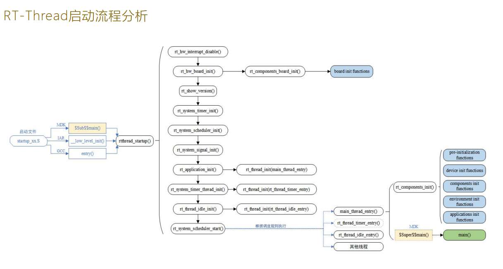
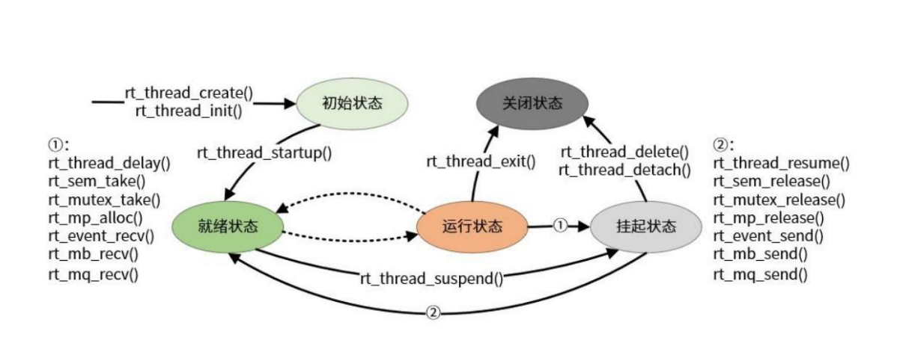
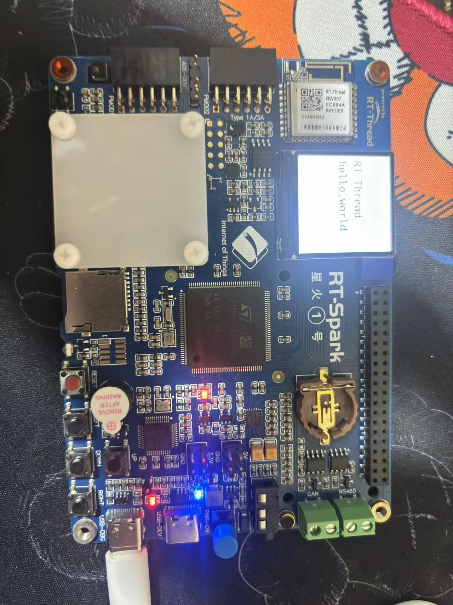

# 多线程学习


## RT-Thread启动流程分析



## 线程的状态

* **初始状态** ： 线程刚开始创建，还没开始运行时就处于，初始状态。

* **就绪状态** ：在就绪状态下，线程按照优先级排队，等待被执行。

* **运行状态** ：线程正在运行，在单核系统中，只有rt_thread_self()函数返回的线程处于运行状态，但多核系统下，运行的线程不止一个。

* **挂起状态**：也称阻塞态，他可能应为资源不够用而挂起等待，或线程主动延时一段时间而挂起。在挂起状态下，线程不参与调度。

* **关闭状态**：当运行结束时，将处于关闭状态。

  

  ## 线程状态转换
  
  

#### 示例：（点亮led和屏幕）：


```c

#include <rtthread.h>
#include<board.h>
#include<drv_gpio.h>
#include<drv_lcd.h>
#ifdef RT_USING_NANO
#include<rtdevice.h>
#endif

#define THREAD_PRIORITY         25
#define THREAD_STACK_SIZE       512
#define THREAD_TIMESLICE        5

#define GPIO_LED_B GET_PIN(F,11)
#define GPIO_LED_R GET_PIN(F,12)

static rt_thread_t tid1 = RT_NULL;

/* 线程1的入口函数 */
static void thread1_entry(void *parameter)
{
    /*点亮LED*/
    rt_pin_mode(GPIO_LED_R,PIN_MODE_OUTPUT);
    while(1)
    {
        rt_pin_write(GPIO_LED_R,PIN_HIGH);
        rt_thread_mdelay(500);
        rt_pin_write(GPIO_LED_R,PIN_LOW);
        rt_thread_mdelay(500);
    }
}

#ifdef rt_align
rt_align(RT_ALIGN_SIZE)
#else
ALIGN(RT_ALIGN_SIZE)
#endif
static char thread2_stack[1024];
static struct rt_thread thread2;

/* 线程2入口 */
static void thread2_entry(void *param)
{
    //屏幕显示
    lcd_clear(WHITE);
    lcd_set_color(WHITE,BLACK);
    while(1)
    {
        lcd_show_string(10,69+16+24,32,"hello,world");
        lcd_show_string(10,69,32,"RT-Thread");
        rt_thread_mdelay(500);
    }

    /* 线程2运行结束后也将自动被系统脱离 */
}

/* 线程示例 */
int lcd_led(void)
{
    /* 创建线程1，名称是thread1，入口是thread1_entry*/
    tid1 = rt_thread_create("thread1",
                            thread1_entry, RT_NULL,
                            THREAD_STACK_SIZE,
                            THREAD_PRIORITY, THREAD_TIMESLICE);
#ifdef RT_USING_SMP
    /* 绑定线程到同一个核上，避免启用多核时的输出混乱 */
    rt_thread_control(tid1, RT_THREAD_CTRL_BIND_CPU, (void*)0);
#endif
    /* 如果获得线程控制块，启动这个线程 */
    if (tid1 != RT_NULL)
        rt_thread_startup(tid1);

    /* 初始化线程2，名称是thread2，入口是thread2_entry */
    rt_thread_init(&thread2,
                   "thread2",
                   thread2_entry,
                   RT_NULL,
                   &thread2_stack[0],
                   sizeof(thread2_stack),
                   THREAD_PRIORITY - 1, THREAD_TIMESLICE);
#ifdef RT_USING_SMP
    /* 绑定线程到同一个核上，避免启用多核时的输出混乱 */
    rt_thread_control(&thread2, RT_THREAD_CTRL_BIND_CPU, (void*)0);
#endif
    rt_thread_startup(&thread2);

    return 0;
}

/* 导出到 msh 命令列表中 */
MSH_CMD_EXPORT(lcd_led, lcdandled);


int main(void)
{
   return 0;
}
```

